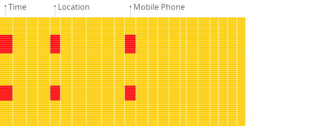

# ¿Qué es ClickHouse?

ClickHouse® es un sistema de gestión de bases de datos SQL orientado a columnas de alto rendimiento (DBMS) para el procesamiento analítico en línea (OLAP). Está disponible tanto como [software de código abierto](https://github.com/ClickHouse/ClickHouse) como una [oferta en la nube](https://clickhouse.com/cloud).

## ¿Qué es OLAP?

Los escenarios OLAP requieren respuestas en tiempo real sobre grandes conjuntos de datos para consultas analíticas complejas con las siguientes características:

- Los conjuntos de datos pueden ser masivos: miles de millones o billones de filas.
- Los datos se organizan en tablas que contienen muchas columnas.
- Solo se seleccionan unas pocas columnas para responder cualquier consulta en particular.
- Los resultados deben devolverse en milisegundos o segundos.

## Bases de datos orientadas a columnas vs Bases de datos orientadas a filas

En un DBMS orientado a filas, los datos se almacenan en filas, con todos los valores relacionados con una fila almacenados físicamente uno al lado del otro.

En un DBMS orientado a columnas, los datos se almacenan en columnas, con valores de las mismas columnas almacenados juntos.

## ¿Por qué las bases de datos orientadas a columnas funcionan mejor en el escenario OLAP?

Las bases de datos orientadas a columnas son más adecuadas para escenarios OLAP: son al menos 100 veces más rápidas en el procesamiento de la mayoría de las consultas. Las razones se explican en detalle a continuación, pero es más fácil demostrarlo visualmente:

**DBMS orientado a filas**

**DBMS orientado a columnas**

¿Ves la diferencia?

El resto de este artículo explica por qué las bases de datos orientadas a columnas funcionan bien para estos escenarios y por qué ClickHouse en particular [sobresale](https://clickhouse.com/docs/en/concepts/why-clickhouse-is-so-fast#performance-when-inserting-data) frente a otros en esta categoría.

## ¿Por qué es ClickHouse tan rápido?

ClickHouse utiliza todos los recursos del sistema disponibles al máximo de su capacidad para procesar cada consulta analítica lo más rápido posible. Esto es posible debido a una combinación única de capacidades analíticas y atención a los detalles de bajo nivel necesarios para implementar la base de datos OLAP más rápida.

Artículos útiles para profundizar en este tema incluyen:

- [Rendimiento de ClickHouse](https://clickhouse.com/docs/en/concepts/why-clickhouse-is-so-fast)
- [Características distintivas de ClickHouse](https://clickhouse.com/docs/en/about-us/distinctive-features)
- [Preguntas frecuentes: ¿Por qué es ClickHouse tan rápido?](https://clickhouse.com/docs/knowledgebase/why-clickhouse-is-so-fast)

## Procesando consultas analíticas en tiempo real

En un DBMS orientado a filas, los datos se almacenan de esta manera:

| Row | WatchID      | JavaEnable | Title             | GoodEvent | EventTime              |
|------|--------------|------------|--------------------|-----------|------------------------|
| #0   | 89354350662  | 1          | Relaciones con Inversores | 1 | 2016-05-18 05:19:20  |
| #1   | 90329509958  | 0          | Contáctanos       | 1 | 2016-05-18 08:10:20  |
| #2   | 89953706054  | 1          | Misión             | 1 | 2016-05-18 07:38:00  |
| #N   | …            | …          | …                  | … | …                      |

En otras palabras, todos los valores relacionados con una fila se almacenan físicamente uno al lado del otro.

Ejemplos de un DBMS orientado a filas son MySQL, Postgres y MS SQL Server.

En un DBMS orientado a columnas, los datos se almacenan de esta manera:

| Row:       | #0          | #1          | #2          | #N |
|-------------|-------------|-------------|-------------|-----|
| WatchID:    | 89354350662 | 90329509958 | 89953706054 | …   |
| JavaEnable: | 1           | 0           | 1           | …   |
| Title:     | Relaciones con Inversores  | Contáctanos | Misión     | …   |
| GoodEvent:  | 1           | 1           | 1           | …   |
| EventTime:  | 2016-05-18 05:19:20 | 2016-05-18 08:10:20 | 2016-05-18 07:38:00 | …   |

Estos ejemplos solo muestran el orden en que se organizan los datos. Los valores de diferentes columnas se almacenan por separado y los datos de la misma columna se almacenan juntos.

Ejemplos de un DBMS orientado a columnas: Vertica, Paraccel (Actian Matrix y Amazon Redshift), Sybase IQ, Exasol, Infobright, InfiniDB, MonetDB (VectorWise y Actian Vector), LucidDB, SAP HANA, Google Dremel, Google PowerDrill, Druid, y kdb+.

Diferentes órdenes para almacenar datos son más adecuados para diferentes escenarios. El escenario de acceso a datos se refiere a qué consultas se realizan, con qué frecuencia y en qué proporción; cuántos datos se leen para cada tipo de consulta: filas, columnas y bytes; la relación entre leer y actualizar datos; el tamaño de trabajo de los datos y qué tan localmente se utiliza; si se usan transacciones y cuán aisladas están; requisitos para replicación de datos e integridad lógica; requisitos de latencia y capacidad de respuesta para cada tipo de consulta, y así sucesivamente.

Cuanto mayor es la carga en el sistema, más importante es personalizar la configuración del sistema para que coincida con los requisitos del escenario de uso, y esta personalización se vuelve más detallada. No hay un sistema que se adapte igual de bien a escenarios significativamente diferentes. Si un sistema es adaptable a un amplio conjunto de escenarios, bajo una alta carga, el sistema manejará todos los escenarios de manera igualmente deficiente, o funcionará bien solo para uno o pocos de los posibles escenarios.

### Propiedades clave del escenario OLAP

- Las tablas son "anchas", lo que significa que contienen un gran número de columnas.
- Los conjuntos de datos son grandes y las consultas requieren un alto rendimiento al procesar una sola consulta (hasta miles de millones de filas por segundo por servidor).
- Los valores de las columnas son bastante pequeños: números y cadenas cortas (por ejemplo, 60 bytes por URL).
- Las consultas extraen un gran número de filas, pero solo un pequeño subconjunto de columnas.
- Para consultas simples, se permiten latencias alrededor de 50ms.
- Hay una gran tabla por consulta; todas las tablas son pequeñas, excepto una.
- El resultado de una consulta es significativamente menor que los datos originales. En otras palabras, los datos se filtran o se agregan, por lo que el resultado cabe en la RAM de un solo servidor.
- Las consultas son relativamente raras (generalmente cientos de consultas por servidor o menos por segundo).
- Las inserciones ocurren en lotes bastante grandes (> 1000 filas), no fila por fila.
- Las transacciones no son necesarias.

Es fácil ver que el escenario OLAP es muy diferente de otros escenarios populares (como OLTP o acceso clave-valor). Por lo tanto, no tiene sentido intentar usar OLTP o una base de datos clave-valor para procesar consultas analíticas si quieres obtener un rendimiento decente. Por ejemplo, si intentas usar MongoDB o Redis para análisis, obtendrás un rendimiento muy pobre en comparación con las bases de datos OLAP.

### Entrada/Salida

1. Para una consulta analítica, solo es necesario leer un pequeño número de columnas de la tabla. En una base de datos orientada a columnas, puedes leer solo los datos que necesitas. Por ejemplo, si necesitas 5 columnas de 100, puedes esperar una reducción de I/O de 20 veces.
2. Dado que los datos se leen en paquetes, es más fácil comprimirlos. Los datos en columnas también son más fáciles de comprimir. Esto reduce aún más el volumen de I/O.
3. Debido al I/O reducido, más datos caben en la caché del sistema.

Por ejemplo, la consulta "cuenta el número de registros para cada plataforma publicitaria" requiere leer una columna "ID de plataforma publicitaria", que ocupa 1 byte sin comprimir. Si la mayoría del tráfico no proviene de plataformas publicitarias, puedes esperar al menos una compresión de 10 veces de esta columna. Al usar un algoritmo de compresión rápido, la descompresión de datos es posible a una velocidad de al menos varios gigabytes de datos sin comprimir por segundo. En otras palabras, esta consulta se puede procesar a una velocidad de aproximadamente varios mil millones de filas por segundo en un solo servidor. Esta velocidad se logra en la práctica.

### CPU

Dado que la ejecución de una consulta requiere procesar un gran número de filas, ayuda despachar todas las operaciones para vectores enteros en lugar de para filas separadas, o implementar el motor de consulta de manera que casi no haya costos de despacho. Si no lo haces, con cualquier subsistema de disco medianamente decente, el intérprete de consulta inevitablemente detiene la CPU. Tiene sentido almacenar datos en columnas y procesarlos, cuando sea posible, por columnas.

Hay dos maneras de hacer esto:

1. Un motor vectorial. Todas las operaciones se escriben para vectores, en lugar de para valores separados. Esto significa que no necesitas llamar a operaciones muy a menudo, y los costos de despacho son insignificantes. El código de operación contiene un ciclo interno optimizado.
    
2. Generación de código. El código generado para la consulta tiene todas las llamadas indirectas en él.

Esto no se hace en bases de datos orientadas a filas, porque no tiene sentido al ejecutar consultas simples. Sin embargo, hay excepciones. Por ejemplo, MemSQL utiliza generación de código para reducir la latencia al procesar consultas SQL. (Para comparar, los DBMS analíticos requieren optimización de rendimiento, no latencia).

Toma en cuenta que, para la eficiencia de la CPU, el lenguaje de consulta debe ser declarativo (SQL o MDX), o al menos un vector (J, K). La consulta solo debe contener bucles implícitos, permitiendo la optimización.
